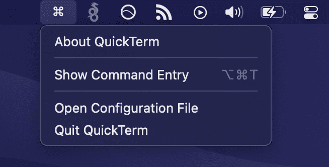

<p align="center">
  
</p>
<p align="center">
  <a href="https://github.com/apple/swift/releases/tag/swift-5.3.2-RELEASE">
    
  </a>
  <a href="https://github.com/AlexGustafsson/quickterm/releases">
    
  </a>
  <a href="https://github.com/AlexGustafsson/quickterm/blob/master/Package.swift">
    
  </a>
  <br>
  <strong><a href="#quickstart">Quick Start</a> | <a href="#contribute">Contribute</a> </strong>
</p>

# QuickTerm
### A macOS 11 application for quickly running shell commands

Note: QuickTerm is currently being actively developed. Until it reaches v1.0.0 breaking changes may occur in minor versions.

<a id="quickstart"></a>
## Quick Start

<p align="center">
  
</p>

To install the application, download the latest release from [here](https://github.com/AlexGustafsson/quickterm/releases).

Once installed, you can start the application either via macOS's UI or the command line.

To interact with the application via the command line, it is recommended to add the following alias.

```
echo 'alias quick="/Applications/QuickTerm.app/Contents/MacOS/QuickTerm"' >> ~/.bash_profile
```

You can now start the app like so:

```
quick
```

And run commands like so:

```
quick echo "Hello, World!"
```

A global hotkey is also available to easily run commands from anywhere. Simply press `⌥⌘T`, enter your command and press `enter`. The same UI is also available under the menu bar, `⌘ > Show Command Entry`.

## Table of contents

[Quickstart](#quickstart)<br/>
[Features](#features)<br />
[Installation](#installation)<br />
[Usage](#usage)<br />
[Screenshots](#screenshots)<br />
[Contributing](#contributing)

<a id="features"></a>
## Features

* Familiar UI
* Easy interaction via CLI or UI
* Support for ANSI escape codes (upcoming)
* Uses virtually zero resources
* Native application written in Swift 5 and SwiftUI
* Per-command configurations via CLI
* Automatic dark mode
* Spotlight-like input with command history
* Tab-completion and auto complete (upcoming)
* Completely configurable with automatic reload
* Configurable, global hotkey for quick access

<a id="installation"></a>
## Installation

### Using homebrew

Upcoming.

### Using pre-built package

Download the latest release from [here](https://github.com/AlexGustafsson/quickterm/releases).

### Build from source

Clone the repository.

```
git clone https://github.com/AlexGustafsson/quickterm.git && cd quickterm
```

Optionally check out a specific version.

```
git checkout v0.3.0
```

Build the application.

```
make build
```

Optionally sign the application.

```
export CODESIGN_IDENTITY="Apple Development: account@example.com (ABCD123EFG)"
make sign
```

Copy the built application to the applications folder.

```
cp -r ./build/QuickTerm.app /Applications
```

### Setup the CLI

The CLI is available in the same binary as the UI and can be run like so:

```
/Applications/QuickTerm.app/Contents/MacOS/QuickTerm --help
```

Though the intended usage is via an alias which you can install like so:

```
echo 'alias quick="/Applications/QuickTerm.app/Contents/MacOS/QuickTerm"' >> ~/.bash_profile
```

<a id="usage"></a>
## Usage

The application consists of three parts: the main application (UI), a communication broker (XPC service) and a CLI.

### UI

The application can be started as any other. Once started, a menu bar icon (`⌘`) will appear. The menu has three available items:

* About QuickTerm
* Show Command Entry
* Quit QuickTerm

Running a command is as simple as clicking on the Show Command Entry button and enter a command in the shown input. The same input view is also available via the global hotkey `⌥⌘T`.

### CLI

The CLI enables you to easily offload commands to QuickTerm. For example, you may run `quick make` to show the build progress as you continue working on other things.

To get started with the CLI, run `quick --help` to see the available functions.

```
OVERVIEW: Run a command in a separate window

USAGE: quick [--animate] [--shell <shell>] [--timeout <timeout>] [--keep] [--wait-for-exit] [--no-bash-profile] [--delay-after-exit <delay-after-exit>] [--working-directory <working-directory>] [--dump] [--print-config-path] [<command> ...]

ARGUMENTS:
  <command>               Command to execute. If none is given, starts the daemon instead

OPTIONS:
  --animate               Whether or not the output should be animated as it's received. Does not work with --wait-for-exit as the output is fully available when shown
  --shell <shell>         The shell to use (default: bash)
  --timeout <timeout>     The number of seconds to wait before terminating the command (default: 5.0)
  --keep                  Whether or not the window should stay until the command finishes or is closed
  --wait-for-exit         Whether or not to wait for the command to exit before presenting the view
  --no-bash-profile       Don't source `~/.bash_profile` before executing the command. Applicable only when using Bash as shell
  --delay-after-exit <delay-after-exit>
                          The number of seconds to wait after exit before closing the notification. Not used if keep is true (default: 3.0)
  --working-directory <working-directory>
                          The working directory to run the command in. Defaults to the current working directory (default: /Users/alexgustafsson/Documents/GitHub/quickterm)
  --dump                  Dump the command configuration as JSON. Will be used if the command is to be ran
  --print-config-path     Print the path to the config file
  -h, --help              Show help information.
```

The most basic usage is to either start the UI application by simply running `quick` or to execute a command by running `quick echo "Hello, World!"`.

As shown in the overview above, there are also options to configure whether or not to animate the output, keep the window open even though the command has exited, when to timeout a command and so on.

For debugging purposes, one may also chose to dump the parsed command configuration by executing a command such as the following.

```
quick --timeout 5 --animate --shell zsh --dump echo "Hello, World!"
```

```json
{"shell":"zsh","animate":true,"timeout":5,"keep":false,"workingDirectory":"file:\/\/\/path\/to\/working\/directory\/","startTime":630156023.25511503,"command":"echo Hello, World!"}
```

### Configuration

QuickTerm is fully configurable. Its config is stored in `~/.config/quickterm/config.yml`. The file is created at launch if it does not already exist. If the file cannot be parsed, the CLI will print an error, the UI will show and alert, but both will continue to work - using the default config instead.

The configuration file looks like this (without the comments):

```yaml
# Configuration for execution of commands
commandConfiguration:
  # The shell to use (called like so: to /usr/bin/env <shell> -c <command>)
  shell: bash
  # The number of seconds to wait before terminating the command
  timeout: 5e+0
  # Whether or not the window should stay until the command finishes or is closed
  keep: false
  # Whether or not the output should be animated as it's received. Does not work with waitForExit as the output is fully available when shown
  animate: false
  # Whether or not to wait for the command to exit before presenting the view
  waitForExit: false
  # Source `~/.bash_profile` before executing the command. Applicable only when using Bash as shell
  sourceBashProfile: true
  # The number of seconds to wait after exit before closing the notification. Not used if keep is true
  delayAfterExit: 3e+0
  # The working directory to use for commands entered via the UI (may be disregarded, will default to CWD when started)
  workingDirectory: /Users/alexgustafsson
hotKeys:
  # The global hotkey used for showing the input view (this value currently does nothing)
  showCommandEntry: option+command+t
```

The values should be familiar as they are the same as those configurable via the CLI on a per-command basis.

The CLI will load the config each time it's run - so the values will be updated each time. The UI / daemon watches the file for changes and will reload the config automatically.

To open the config, either use the UI via Open Configuration File, or use the CLI; `nano $(quick --print-config-path)`.

To easily show your current configuration, you can use quick:

```
quick 'cat $(quick --print-config-path)'
```

<a id="screenshots"></a>
## Screenshots

<p align="center">
  
</p>

<p align="center">
  
</p>

<p align="center">
  
</p>

<p align="center">
  
</p>

<a id="contribute"></a>
## Contribute

QuickTerm is currently actively being developed and has not yet been stabilized.

Any contribution is welcome. If you're not able to code it yourself, perhaps someone else is - so post an issue if there's anything on your mind.

If you're new to the open source community, Swift, GitHub or just uncertain where to begin - [issues labeled "good first issue"](https://github.com/AlexGustafsson/quickterm/labels/good%20first%20issue) are a great place to start. Just comment on an issue you'd like to investigate and you'll get guidance along the way.

### Development

```
# Clone project
git clone https://github.com/AlexGustafsson/quickterm.git && cd quickterm

# Show available commands
make
make help

# Setup the project for development (installs git hooks)
make setup

# Run the application (UI)
make run

# Run the application (CLI). All arguments to the CLI must be given via the args parameter
make run args="ls"

# Tail all logs created by the application at runtime
make logs

# Run application tests
make test

# Lint the code
make lint

# Format the code
make format

# Build the application
# Creates ./build/QuickTerm.app
make build

# Sign the application
# Use "security find-identity -v -p codesigning" to find available certificates.
# Specify your identity in CODESIGN_IDENTITY
make sign

# Package the application (does not sign the application, must be done explicitly before packaging)
# Creates a versioned bundle zip and dmg in ./distribution
make package

# Remove any dynamically created files
make clean
```

### Code layout

Project-wide files such as the Makefile etc. lies at the top of the directory tree.

The `Sources` and `Tests` directory are home for source files and tests, respectively. Each project has their own directory.

The `SupportingFiles` directory contains one directory per subproject. Each project directory has files such as `Info.plist`, `Entitlements.plist` and resources (which are copied to the built app bundle).

The following directories may exist in each project's source directory:

* `Components` - SwiftUI view components, such as a button etc.
* `Controllers` - Window / view controllers
* `Extensions` - Extensions to existing Swift classes such as `Color`
* `Utilities` - Utilities such as algorithm implementations (`Queue` etc.)
* `Views` - SwiftUI views

### Contributors

Inspired by [qcmd](https://radioaktiv.zone/git/b/qcmd) by [b10rn](https://github.com/b10rn).
